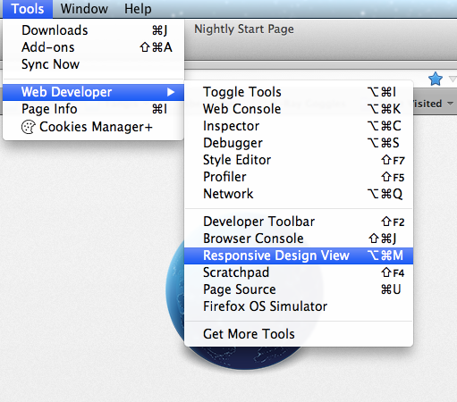
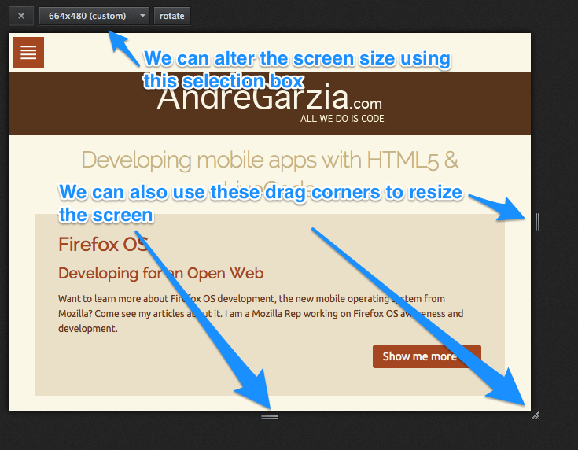
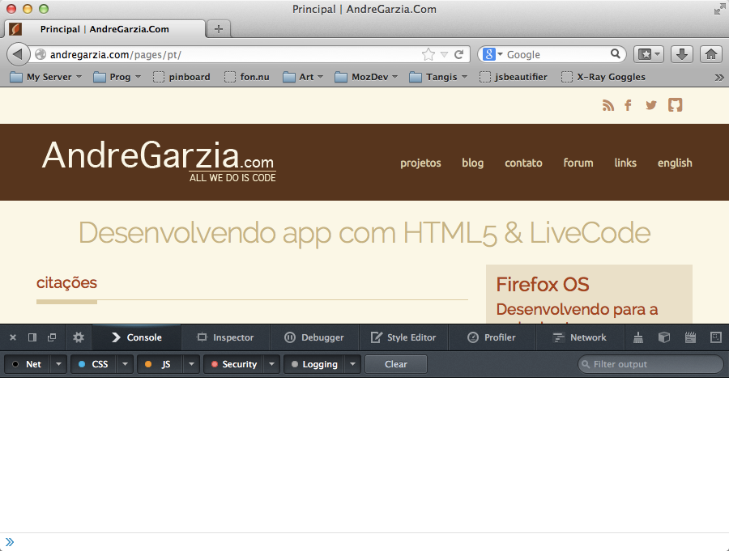

# Developer Tools {#developertools}

Firefox has many tools to help web developers do their job. Many people are still using [FireBug](https://addons.mozilla.org/pt-BR/firefox/addon/firebug/) and don't realize that Firefox already has its own built-in tools. In this sections we're going to do a quick review of some of the tools that are useful for mobile apps developers.

If you're interest in learning more about these tools and what other dev tools goodness is about to land in Firefox you may want to check [the MDN page about developer tools](https://developer.mozilla.org/en-US/docs/Tools) (really, go check that link, I will wait).
 
## Introducing the Responsive Design View

One of the most pleasant things when we're doing web development is the fact that we can simply change some HTML file and then reload the page in the browser to review our changes without the need for a compilation step or something similar. Even though the Firefox OS Simulator permits you to use that same workflow, sometimes we just want to test our apps on Firefox on the desktop. This type of workflow is pretty common when you're dealing with hosted apps that adapts to different screen sizes such as desktops, tablets and smartphones. In these case you should use the **Responsive Design View** tool to change the screen (and viewport) to the most common resolutions used by mobile devices and check how your work performs on those sizes.

Using the responsive design view is specially important for those working with [**media queries**](https://developer.mozilla.org/en-US/docs/Web/Guide/CSS/Media_queries) because it allows you to resize the screen and test your CSS.

The responsive design view can be activated by going to the **Tools menu -> Web Developer -> Responsive Design View** as shown in the image below.

When you activate this tool, Firefox screen changes so that you can alter the viewport size using the drag corners or the selection box.

Most of the Firefox OS phones that are on the market are running on a 480x320 resolution but instead of hard coding your CSS to this size you should use media queries and the responsive design methodology to create apps that adapt to any screen size. To learn more about responsive design, I recommend the following books [Responsive Web Design](http://www.abookapart.com/products/responsive-web-design) e o [Mobile First](http://www.abookapart.com/products/mobile-first).

In summary, the responsive design view allows us to test our web applications using many different screen sizes without the need to resize the Firefox browser window itself. In my humble opinion this is one of the most useful web developer tool available in the world and I have no clue why the other vendors have not copied it yet.

## Other tools

Firefox developer tools are similar to FireBug and the tools from Google Chrome. They allow you to interact with the DOM, to fiddle with the JavaScript environment that is running and much more. Using these tools you can execute and debug your JavaScript functions using [the console object](https://developer.mozilla.org/en-US/docs/Web/API/console) and manipulate both the DOM and the CSS on the current page. Those tools are a life saver and I can't believe people still do web work without them.

 

Besides the *JavaScript Console* there are many other tools available such as [*the style editor*](https://developer.mozilla.org/en-US/docs/Tools/Style_Editor), [*the network monitor*](https://developer.mozilla.org/en-US/docs/Tools/Network_Monitor), [*the JavaScript profiler*](https://developer.mozilla.org/en-US/docs/Tools/Profiler), [*the JavaScript debugger*](https://developer.mozilla.org/en-US/docs/Tools/Debugger), [*the page instpector*](https://developer.mozilla.org/en-US/docs/Tools/Page_Inspector) and many others.

In the application we've built in the previous chapter, we used the console to check the progress of our application. This is a pretty powerful way to debug our apps but some developers are still lost using `alerts()` spread all over their source code as their "debug tool". Learning how to properly use the developer tools bundled with Firefox (or whatever browser you're using) is an important step in becoming a better developer. Thats why I advise everyone to check the links above and get more familiar with the various tools available. One special tool that was not mentioned above is the [*remote debugger*](https://developer.mozilla.org/en-US/docs/Tools/Remote_Debugging) that will allow us to connect a phone running Android or Firefox OS and use the developer tools to debug the code that is running on the device.

## Summary

This was a *tour chapter* to give the reader enough references to learn more about the tools that come bundled with the Firefox browser. Using these tools will make your life happier, specially when you use them together with the Firefox OS simulator. They are an invincible combination for application construction and in the next chapter we're going to learn more about the simulator.